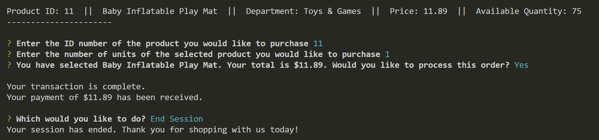

# Bamazon
A Node.js Amazon-like storefront using MySQL and Inquirer packages

___

## Overview
* This is a command line storefront application that allows a customer to access a database of products for sale and then select and purchase their desired products. The database will then update after each transaction.

___

## Setup
To run Bamazon, you will need to install both [MySQL](https://dev.mysql.com/doc/refman/5.6/en/installing.html) and [Node.js](https://nodejs.org/en/download/). 

### MySQL Database Setup 
Once MySQL is installed, you will be able to create the *Bamazon* database and the *products* table using the SQL file [bamazon.sql](bamazon.sql) located in this repository. Run this code inside your MySQL client (e.g. [MySQL Workbench](https://dev.mysql.com/downloads/workbench/)) to create and populate the database. You will then be ready to proceed with running the Bamazon customer interface.

### Running Bamazon
Once you have the database set up, run these commands in the command line:

```
git clone https://github.com/fzachary/bamazon.git
cd bamazon
npm install
node bamazonCustomer.js
```

___

## Customer Demo
The customer interface:
1. Presents a table containing all of the available products 
2. Prompts the customer to input the ID number of the customer's desired product 
3. Asks the customer what quantity of the selected product they would like to purchase--if the customer requests a higher quantity of an item than is currently in stock, they are alerted, and asked to start their order again 
4. Prompts the customer to confirm their order once they have selected a sufficient quantity of their desired item, then processes the hypothetical payment and updates the product inventory in the database  
5. Asks the customer if they would like to continue shopping or end the session   

___

## Technologies Used
* Javascript
* Node.js
* MySQL
* NPM Packages:
    - [mysql](https://www.npmjs.com/package/mysql)
    - [inquirer](https://www.npmjs.com/package/inquirer)

___

## Contributing
To contribute to this application:
1. Fork the repo
2. Create your feature branch: `git checkout -b my-new-feature`
3. Commit your changes: `git commit -m 'add my-new-feature'`
4. Push to the branch: `git push origin my-new-feature`
5. Submit a pull request

___
